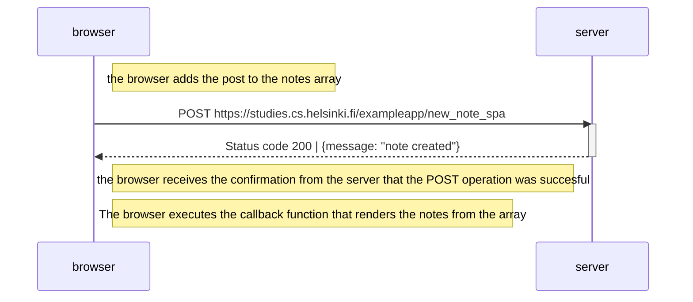

```mermaid
sequenceDiagram
    participant browser
    participant server
    
    note right of browser: the browser adds the post to the notes array

    browser->>server: POST https://studies.cs.helsinki.fi/exampleapp/new_note_spa
    activate server
    server-->>browser: Status code 200 | {message: "note created"}
    deactivate server

    note right of browser: the browser receives the confirmation from the server that the POST operation was succesful 


    Note right of browser: The browser executes the callback function that renders the notes from the array
```